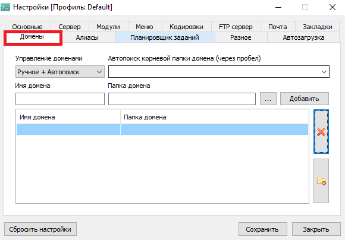
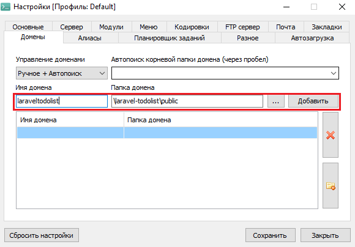
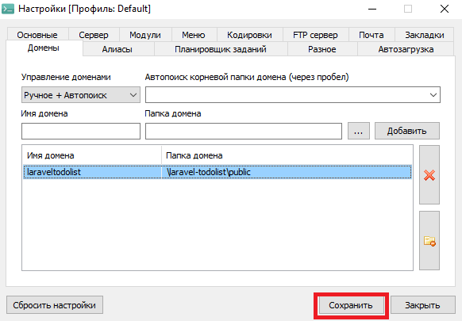

# Laravel-ToDoList
Список дел на Laravel

## Устнаовка
1 Скачайте и установите Open Server
https://ospanel.io/

Зайдипе в папку \openserver\domains и скачайте проект
```bash
git clone https://github.com/MindYume/Laravel-ToDoList.git
```
2 Запустите Open Server, и зайдите в настройки
### 
3 В настройках зайдите в раздел "Домены" и добавтье домен с любым именем
### 
### 
### 

3 Создайте базу данных из миграций. Для этого запуствите консоль через Open Server, зайдите в папку с проектами и запустите следующую команду
```bash 
php artisan migrate
```
