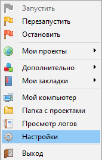

# Laravel-ToDoList
Список дел на Laravel

## Устнаовка
1 Скачайте и установите Open Server
https://ospanel.io/

Зайдипе в папку \openserver\domains и скачайте проект
```bash
git clone https://github.com/MindYume/Laravel-ToDoList.git
```
2 Запустите Open Server, и зайдите в настройки


3 Создайте базу данных из миграций
```bash 
php artisan migrate
```
